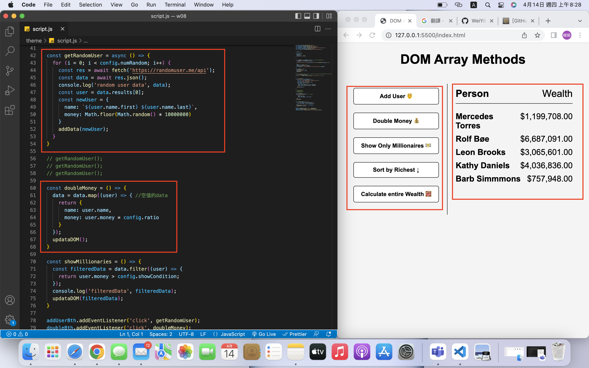
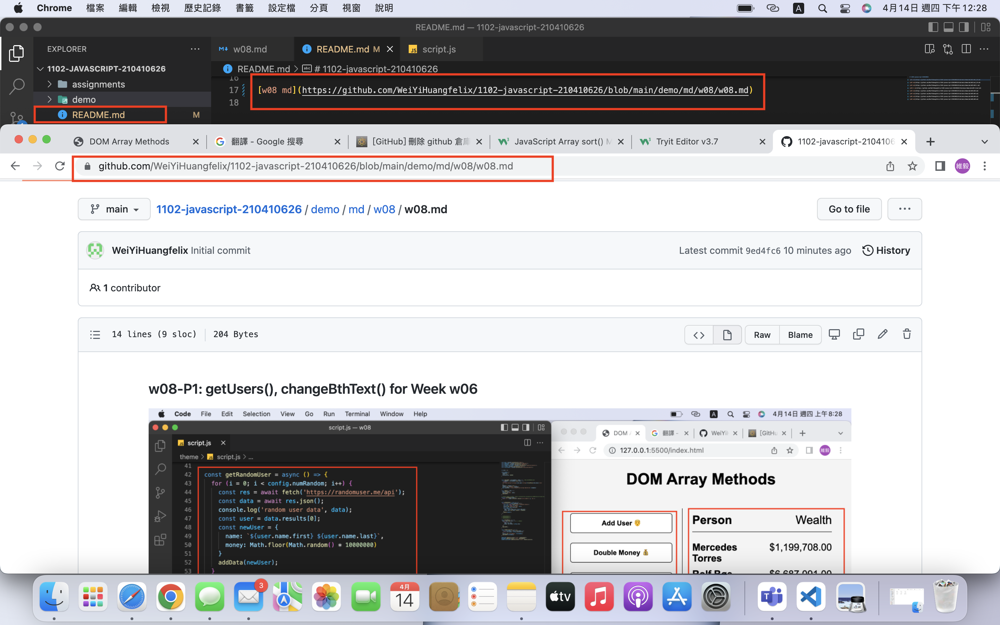
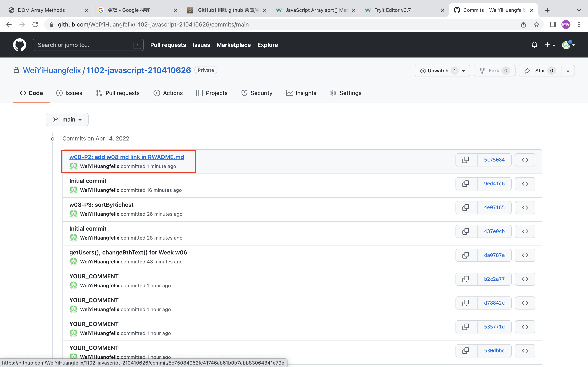
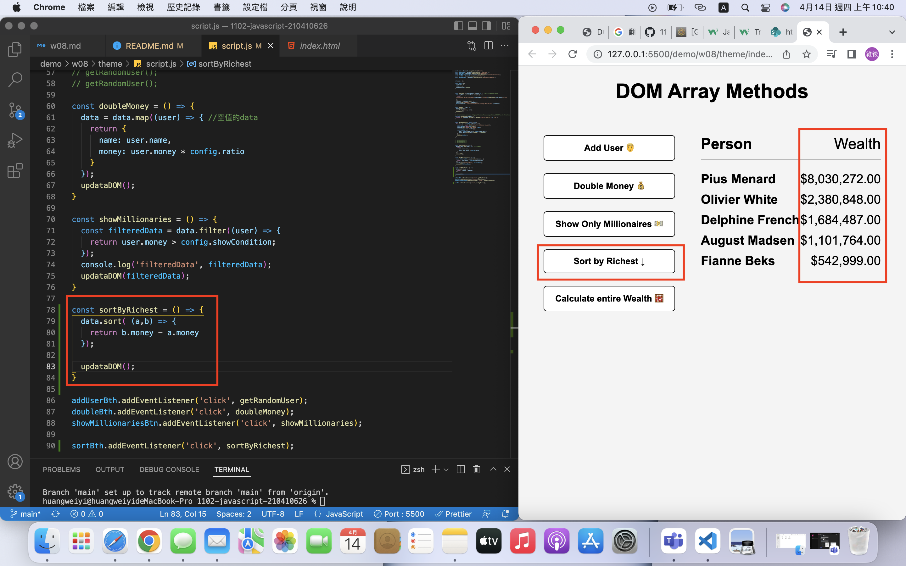
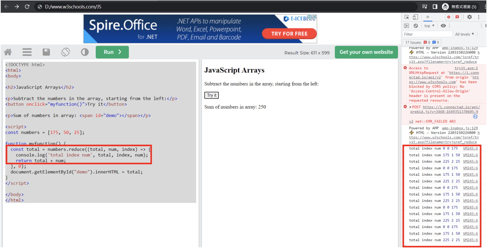
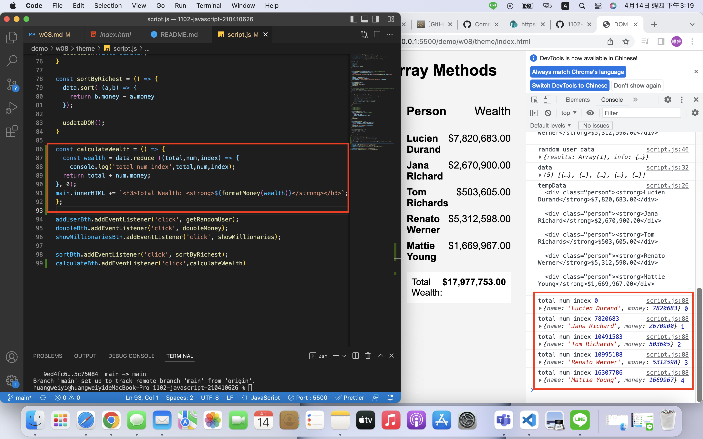

### w08-P1: getUsers(), changeBthText() for Week w06

### w08-P2: add w08 md link in RWADME.md

### w08-P3: sortByRichest

### W08-P4: trace total using offline W3School

### W08-P5: Conut wealth total for all users money

