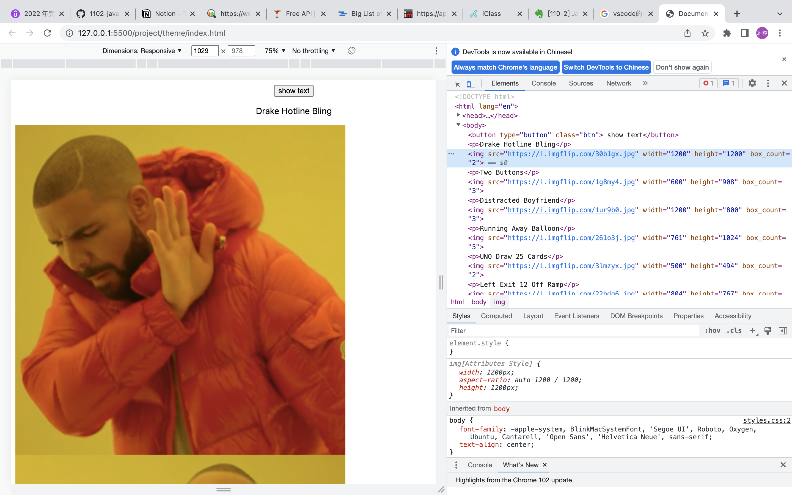
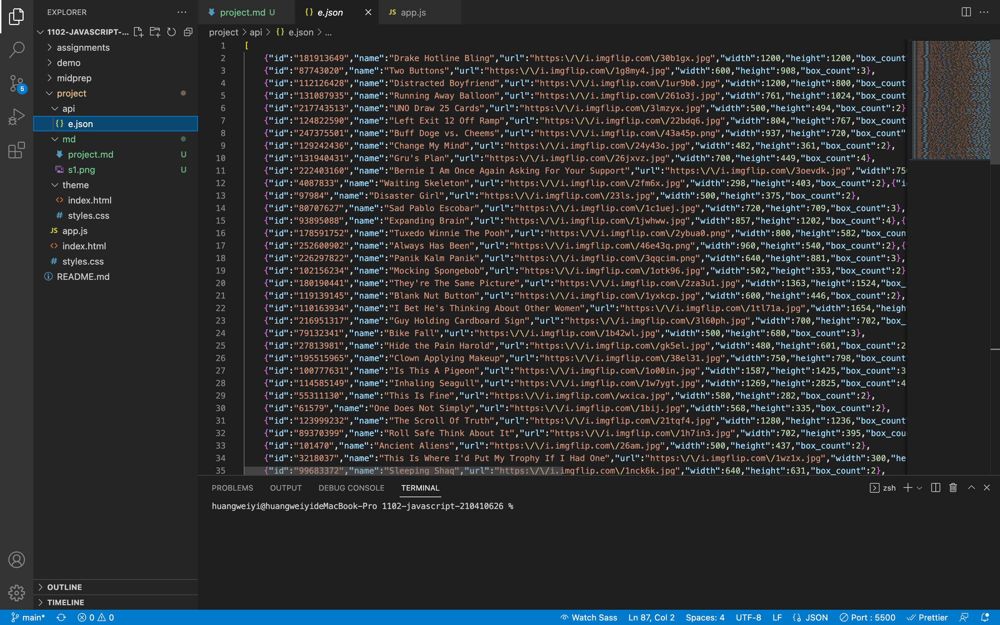
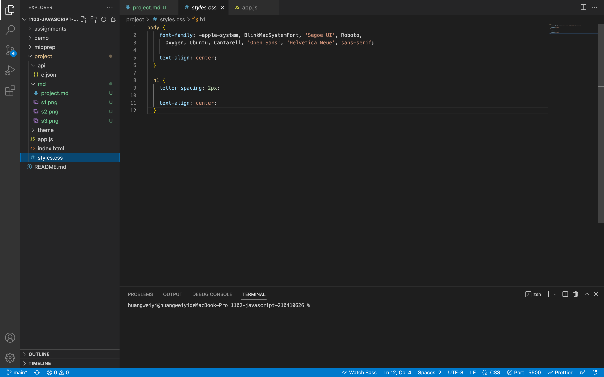
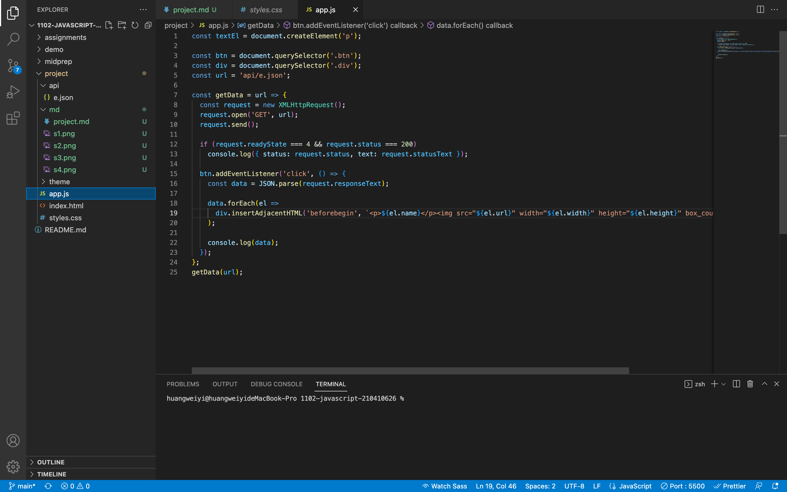

### S1 -- theme 設計

##### 呈現api 右鍵檢查點進內容 複製html裡面的body程式碼和css 這樣在無網路狀態也能呈現

### S2 -- 開始 api 實作

##### 我是用json的方式來呈現api

### S3 -- 實作S3

##### 我在body裏面做了一顆按鈕來呈現畫面

### S4 -- 實作S4

##### 在css只有很簡單的置中跟改變字體大小

### S5 -- 實作S5

##### 我是用教授教的按鈕來抓取json裡面的資料 來呈現api

### 自主學習

##### https://www.youtube.com/watch?v=yZwlW5INhgk&t=759s 目前是看youtube上面的教學影片來學習

##### 在udemy平台買javascript課程學習更深入的技巧 目前觀看到第二章節 陣列的部分

##### 有再好學校平台購買動態網頁設計 來學習不同網路頁面呈現的方式

