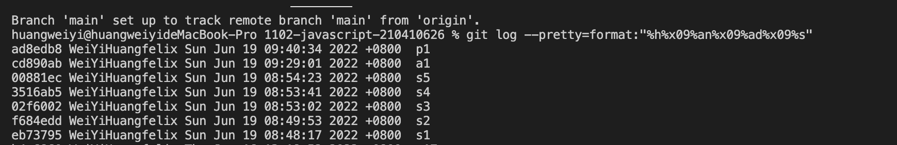

### S1 -- theme 設計

##### 呈現api 右鍵檢查點進內容 複製html裡面的body程式碼和css 這樣在無網路狀態也能呈現

### S2 -- 開始 api 實作

##### 我是用json的方式來呈現api

### S3 -- 實作S3

##### 我在body裏面做了一顆按鈕來呈現畫面

### S4 -- 實作S4

##### 在css只有很簡單的置中跟改變字體大小

### S5 -- 實作S5

##### 我是用教授教的按鈕來抓取json裡面的資料 來呈現api

### 自主學習

##### https://www.youtube.com/watch?v=yZwlW5INhgk&t=759s 目前是看youtube上面的教學影片來學習

##### 在udemy平台買javascript課程學習更深入的技巧 目前觀看到第二章節 陣列的部分

##### 有再好學校平台購買動態網頁設計 來學習不同網路頁面呈現的方式

### 解決問題

##### 遇到問題 先看教授是否有教過 如果沒有的話 上網查關鍵字 找尋是否有相關的問題解決方法

##### 還有遇到問題 看不懂的地方 先log看看 看看資料是否有被抓取 如果沒有可能 一開始就寫錯了 如果有抓取 表示觀念正確 在看錯誤訊息提示什麼 再去網路找答案排除

##### 通常還不了解的情況 都是用教授所教的方式去呈現網頁 大部分問題都不大 只是要去了解內容在寫什麼 才能慢慢去解決問題

### project-last-log

